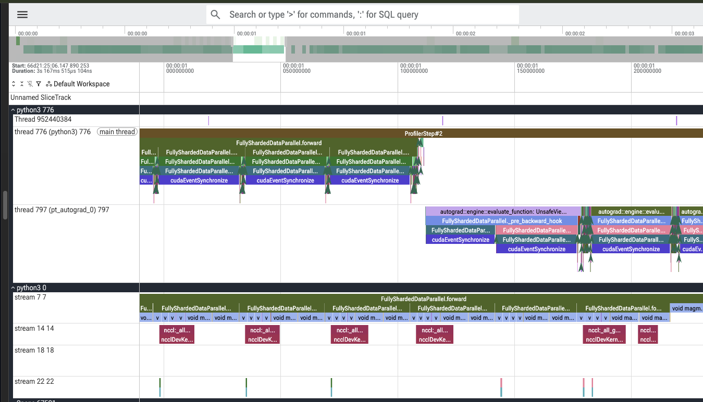

# Distributed ~1.15B Parameter Transformer Training via PyTorch FSDP (Dual T4, Kaggle)

## Objective
This repository demonstrates sharding and training a ~1.15B parameter custom
Transformer across two Kaggle T4 GPUs using PyTorch's Fully Sharded Data
Parallel (FSDP, ZeRO-3), and profiling the resulting execution with Perfetto
to verify how weight all-gathers, backward compute, and gradient
reduce-scatters overlap in practice.

## Architecture Specs
* **Parameters:** ~1.15 Billion
* **Hidden Dimension:** 2048
* **Attention Heads:** 16
* **Layers:** 20
* **Vocabulary Size:** 32,000
* **Sequence Length:** 512
* **Hardware:** 2x NVIDIA T4 (15GB VRAM each), Kaggle

## The Constraint: 15GB VRAM per T4
A single T4 has 15GB of VRAM. With the model wrapped in a `bfloat16` mixed
precision policy, a rough unsharded memory estimate is:

| Component | Approx. size |
|---|---|
| Weights (bf16, 2 bytes/param) | ~2.3 GB |
| Gradients (bf16, 2 bytes/param) | ~2.3 GB |
| AdamW optimizer state (2 moments) | ~4.6 GB |
| **Subtotal** | **~9.2 GB** |

That subtotal alone leaves little headroom on a single 15GB card once
activations, the profiler's own bookkeeping (`profile_memory=True`,
`record_shapes=True`), and NCCL communication buffers are added — which is
what motivated sharding across two GPUs rather than trying to fit everything
on one.

*Note: this is a theoretical estimate based on the `MixedPrecision` policy
applied to params/grads/buffers. PyTorch does not guarantee optimizer state
dtype matches the mixed-precision policy without explicit configuration —
for a citation-quality number, verify with `torch.cuda.memory_allocated()`
on an actual run rather than relying on this estimate alone.*

## The Solution: Fully Sharded Data Parallel (ZeRO-3)
This implementation uses PyTorch FSDP to shard model weights, gradients, and
optimizer states across 2 GPUs over an NCCL backend.

Key implementation details:
* **Layer-by-layer auto-wrapping:** `transformer_auto_wrap_policy` is applied
  to `TransformerBlock` instances, so FSDP shards per-block rather than
  treating the whole model as one flat parameter blob.
* **Mixed precision:** a `MixedPrecision` policy sets `param_dtype`,
  `reduce_dtype`, and `buffer_dtype` all to `bfloat16`, reducing per-GPU
  memory footprint and communication volume.
* **Explicit Q/K/V/out projections:** `nn.MultiheadAttention` is avoided in
  favor of explicit `q_proj` / `k_proj` / `v_proj` / `out_proj` linear layers,
  which sidesteps known hidden-buffer deadlocks during FSDP auto-wrapping.
* **Deterministic init across ranks:** `torch.manual_seed(42)` /
  `torch.cuda.manual_seed_all(42)` are set identically on every rank before
  model construction, so sharded parameters match across GPUs pre-training.

### Known simplification
The current `TransformerBlock.forward` computes attention as an elementwise
product `out_proj(q * k * v)` rather than real scaled dot-product attention
(no `Q @ Kᵀ`, no softmax, no `1/√d` scaling, and `NUM_HEADS` is not used to
split into per-head attention). This is sufficient as a parameter-count and
FSDP-sharding stress test, but it does **not** implement functioning
attention — noted here for transparency rather than glossed over.

## Profiling Methodology
Profiling used `torch.profiler` with schedule `wait=1, warmup=1, active=1,
repeat=1` across 3 training steps, so only the third step (step index 2,
labeled `ProfilerStep#2` in the trace) was actually captured — steps 0 and 1
ran but were discarded (wait/warmup). Traces were exported per-rank via
`tensorboard_trace_handler` and viewed in Perfetto (`ui.perfetto.dev`).

## Profiling Findings
* **Forward pass:** the CPU main thread's `FullyShardedDataParallel.forward`
  span lines up directly with continuous compute activity on the GPU's
  compute stream, with `nccl:_all_gather` calls firing on a separate stream
  immediately before each layer's compute kernel — i.e. each layer's full
  (unsharded) weights are fetched via all-gather right before that layer
  computes, and released again afterward, which is the core FSDP memory
  tradeoff made visible.
* **Backward pass:** backward hooks (`_pre_backward_hook`,
  `_pre_backward_prefetch`, `rate_limiter`) execute on a dedicated autograd
  worker thread, separate from the main thread, once per FSDP-wrapped block.
  Each cycle pairs backward compute with an `nccl:_reduce_scatter` call on
  its own stream, syncing gradients across ranks per-layer rather than
  once at the end.
* **CPU/GPU synchronization:** `cudaEventSynchronize` calls appear once per
  layer on both the main and autograd threads — these are the CPU blocking
  briefly on GPU completion, and are a candidate location to check for
  synchronization overhead if profiling shows the CPU idling on them for a
  significant fraction of step time.

### Trace screenshot


*Perfetto view of the forward pass: `nccl:_all_gather` operations (stream 14)
fetch each layer's full weights immediately before that layer's compute
kernels run on the compute stream (stream 7), directly beneath the CPU-side
`FullyShardedDataParallel.forward` calls on the main thread.*

## Running It
```bash
torchrun --nproc_per_node=2 fsdp_profiler.py
```
